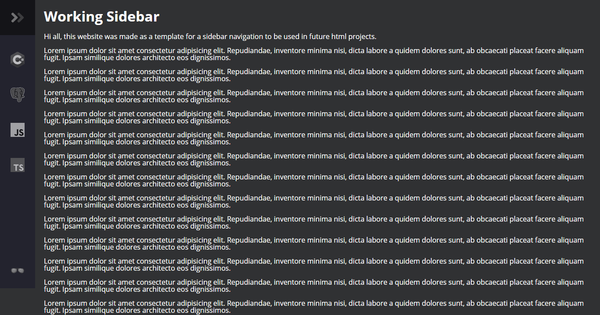
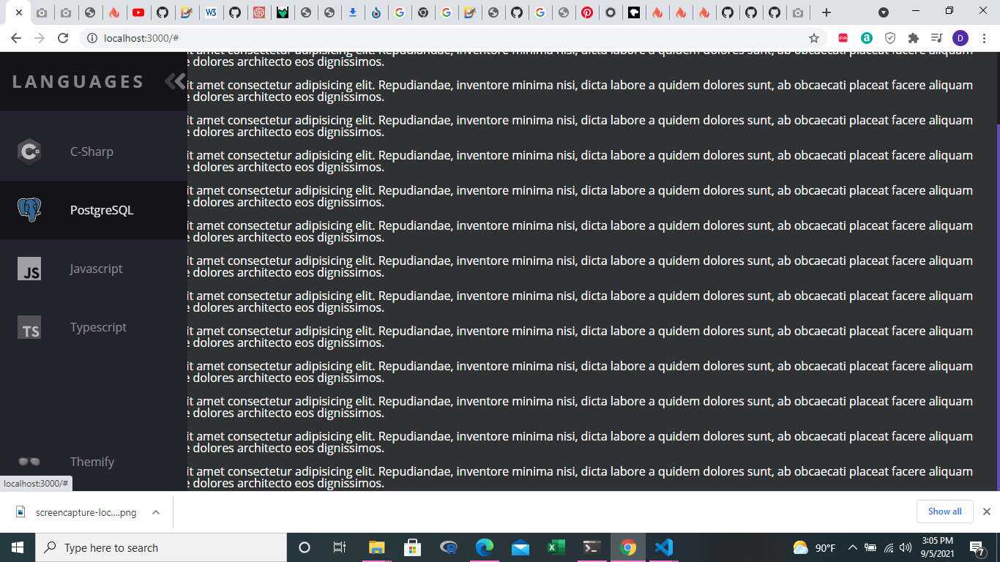

# sidebar-template

## Assignment

The goal of this assignment was to create a basic animated sidebar to act as a template for future html projects.



The above is a screen capture of the sidebar that I created.



The above is a screen capture of the sidebar that I created expanded to be used in future html projects.

<br/>

A link to the webpage that I made can be found in the **About** section of this repository or below.

```html
https://sidebar-template-dommitchell.netlify.app/
```
